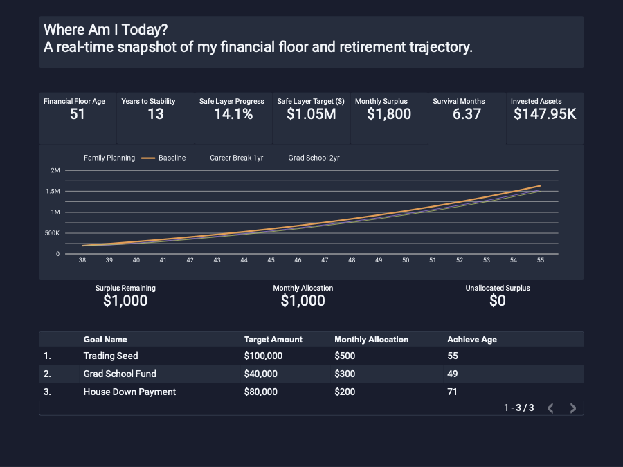
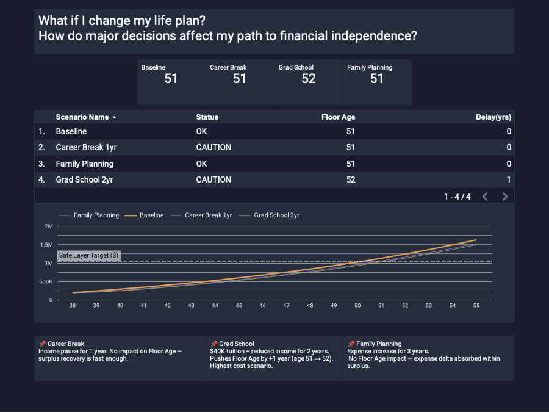

# Financial Floor Decision Lab

**A system that defines when you become financially safe — and how decisions change that timeline.**  
Built to answer one question: *When do I become financially safe — and how do life decisions change that timeline?*

---

## What This Is

Most finance tools answer: *How much do you have?*

This answers:
- When is my Financial Floor Age?
- What happens to that date if I take a career break, go to grad school, or start a family?
- How do income, expenses, and investing change the timeline?

---

## Tools Used

| Layer | Tool | Purpose |
|---|---|---|
| Data modeling | Excel / Google Sheets | IS → CF → BS calculation engine |
| Visualization | Power BI | KPI cards, scenario comparison, trajectory charts |
| Visualization | Looker Studio | Executive dashboard, live Google Sheets connection |
| Version control | GitHub | Portfolio documentation |

---

## Repository Structure

```
financial-floor-decision-lab/
├── README.md
├── data/
│   ├── financial_floor_v5.xlsx          ← working single-user prototype
│   └── financial_floor_ledger_v2.xlsx   ← multi-user ledger-first schema design
├── docs/
│   ├── architecture.md                  ← IS → CF → BS design principles
│   ├── metric_definitions.md            ← KPI formulas and definitions
│   └── data_model.md                    ← schema and table relationships
└── images/
    ├── overview.png
    ├── scenario_comparison.png
    └── looker_dashboard.png
```

---

## Core Concepts

### Financial Floor Age
The age at which projected invested assets first reach the Safe Layer Target — the point where passive income covers target retirement spending without depleting principal.

```
Safe Layer Target = (Target Annual Spend - Social Security) / Withdrawal Rate
Financial Floor Age = first year where Invested Assets ≥ Safe Layer Target
```

### IS → CF → BS Architecture

All calculations follow accounting-first logic:

```
Income Statement (IS)   → What is the surplus constraint?
        ↓
Cash Flow (CF)          → How is surplus allocated? (retirement / goals / residual)
        ↓
Balance Sheet (BS)      → What is the resulting asset state?
        ↓
Metrics                 → Floor Age, Years to Stability, Safe Layer Progress
```

This structure maps directly to a multi-user database schema. Every row in the ledger carries `household_id`, making it ready for Postgres/Supabase migration.

---

## v5 Prototype — Key Results

**Sample profile: age 38, $4,800/mo net income, $147,952 invested assets**

| Metric | Value |
|---|---|
| Safe Layer Target | $1,050,000 |
| Safe Layer Progress | 14.1% |
| Baseline Floor Age | 51 |
| Years to Stability | 13 |
| Survival Months | 6.4 |

**Scenario comparison:**

| Scenario | Floor Age | Delta |
|---|---|---|
| Baseline | 51 | — |
| Career Break 1yr | 51 | +0 |
| Grad School 2yr | 52 | +1 |
| Family Planning | 51 | +0 |

---

## Key Insight

Financial planning becomes simple once constraints are clearly defined.
Most decisions do not materially change the financial floor — but a few do.

---

## Two Files, Two Purposes

### `financial_floor_v5.xlsx`
Single-user working prototype. All calculations live in Excel formulas — no Python, no macros. Error count: 0. Formula count: 2,186.

What works:
- Financial Floor Age (confirmed at 51 vs. expected 51 ✓)
- Scenario comparison across 4 scenarios × 40-year projection
- CF waterfall: surplus → retirement → goals → residual cash = $0
- All views derived from a single projection engine

### `financial_floor_ledger_v2.xlsx`
Schema design for a multi-user, ledger-first system. Modeled after ERP posting logic.

What this demonstrates:
- Chart of accounts with DR/CR normal signs
- Event driver → posting rules → ledger postings pipeline
- IS / CF / BS as derived views, not source tables
- `household_id` on every fact row — ready for multi-tenant DB normalization

**Known limitation:** Ledger postings are sample data for periods 0–1 only. The posting generator (recurring event expansion + compounding) is the V3 build target.

---

## Why Two Layers?

The v5 Excel prototype answers the personal finance question now.  
The ledger schema answers the product architecture question for later.

If this became a SaaS product:

```
Current (Excel):   1 user, formula-driven, no persistence
V3 target (DB):    N users, posting-engine-driven, append-only ledger
                   household_id + profile_id + scenario_id → all facts
```

The schema is already normalized for that migration. Adding `user_id` to the master tables is the only structural change required.

---

## Metric Definitions

| Metric | Formula |
|---|---|
| `surplus` | monthly_income − monthly_expense |
| `starting_invested_assets` | brokerage + retirement_accounts *(cash excluded)* |
| `safe_layer_target` | (target_monthly_spend × 12 − social_security × 12) / withdrawal_rate |
| `safe_layer_progress` | starting_invested_assets / safe_layer_target |
| `survival_months` | cash / monthly_expense |
| `floor_age` | current_age + first projection year where assets ≥ safe_layer_target |
| `years_to_stability` | floor_age − current_age |

**Key design decisions:**
- Cash is a survival buffer only — excluded from compounding calculations
- 401k is modeled as payroll-deducted (outside surplus), paused during career_break / grad_school scenarios
- Scenarios are parallel branches from the same opening balance, not sequential overwrites

---

## Scenario Types

| Type | IS Impact | BS Impact | Example |
|---|---|---|---|
| `baseline` | None | None | Normal projection |
| `flow_shock` | Income / expense delta | Indirect via CF | Career break, family planning |
| `stock_shock` | None | Direct cash reduction | Travel fund, medical cost |
| `hybrid` | Flow + stock | Both | Grad school (income drop + tuition) |

---

## Roadmap

**V1 (done):** Single-user Excel prototype with working floor_age calculation  
**V2 (done):** Ledger-first multi-user schema design  
**V3 (next):** Python posting generator — recurring event expansion + compounding postings  
**V4:** Postgres migration, API layer, Looker Studio live connection at scale

---

## Live Dashboard

## Dashboard Screenshots

### Page 1 — Where Am I Today


### Page 2 — What If


Looker Studio report (sample data):  
[Financial Floor — Executive View](https://lookerstudio.google.com/reporting/c8a3698c-821c-4670-a1e2-48ac1da1e6ba)

---

*Built as a portfolio project demonstrating constraint-based financial modeling, multi-layer data architecture, and BI tool integration (Power BI + Looker Studio).*
